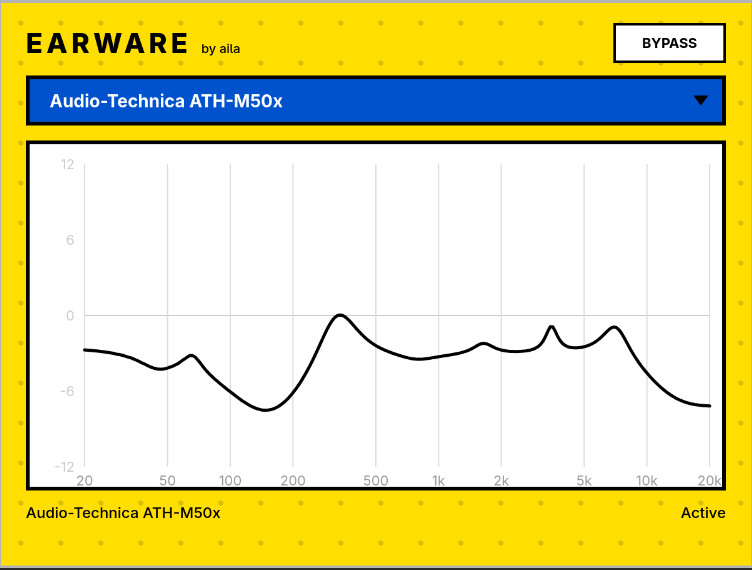

# Earware

Earware is a preset-based corrective EQ that flattens your headphones toward an uncolored target.  It was born out of frustration with bad gain staging and invasive DRM software in big-box corrective plugins, as well as my fatigue from manually inputting EQ values in every DAW I use on every system I use.

Throw it on your master and pick your cans from a searchable library of **736 Headphone Models!**
 
 EQ data is sourced [oratory1990](https://github.com/jaakkopasanen/AutoEq)'s measured database.  Earware applies the matching correction to both your EQ and it's subtracted gain, so you'll be listening at the same volume you started at.  The volume bypass lets you A/B against the uncorrected signal.

 


 This project was built with some amazing open-source software, most notably **Noizefield's** awesome [audio-plugin-coder](https://github.com/Noizefield/audio-plugin-coder) repository, an extensive skillset and context management system for building JUCE plugins.  It was utilized in combination with [OpenCode](https://opencode.ai/) and DeepSeek's highly efficient v4 flash model.

 


> **I need help!!!!** The macOS VST3/AU build is new and not yet field-tested.  Similarly, no DAWS have been tested extensively besides Reaper on any platform. Please try it in your DAW and [open an issue](https://github.com/AilaScott/Earware/issues/new), including which DAW/OS you're using.

## For Musicians and Engineers!

Download the build for your platform from the [Releases](https://github.com/AilaScott/Earware/releases) page:

| Platform | Formats | Files |
|----------|---------|-------|
| Linux x64 | VST3 | `Earware_Linux_x64_VST3.zip` |
| Windows x64 | VST3 | `Earware_Windows_x64_VST3.zip` |
| macOS (Universal) | VST3, AU | `Earware_macOS_Universal_VST3.zip`, `Earware_macOS_Universal_AU.zip` |

To install, unzip and copy the plugin folder into your audio plugin directory:

- **VST3** — `~/.vst3/` (Linux), `C:\Program Files\Common Files\VST3\` (Windows), `~/Library/Audio/Plug-Ins/VST3/` (macOS)
- **AU (macOS)** — `~/Library/Audio/Plug-Ins/Components/`

See the [user manual](plugins/Earware/Documentation/USER_MANUAL.md) for full usage.

## For Devs

Building from source requires **CMake ≥ 3.22**, a **C++20 compiler**, and the **JUCE 8.0.12** git submodule (a vendored JSON-length fix is applied at configure time — see `patches/`). Platform tooling: WebKitGTK/GTK3/Jack/ALSA on Linux, Visual Studio 2022 + the WebView2 SDK (resolved via NuGet) on Windows, and the system WKWebView on macOS.

```bash
git clone https://github.com/AilaScott/Earware.git
cd Earware
git submodule update --init --recursive
cmake -B build -DCMAKE_BUILD_TYPE=Release
cmake --build build --config Release
```

Targets: `Earware_VST3` (all platforms), `Earware_AU` (macOS), `earware_rendertest` (Linux headless render test).

Details: [Windows build notes](plugins/Earware/Documentation/WINDOWS_BUILD.md) and [build/CI reference](docs/BUILD_AND_CI_REFERENCE.md).

## License

GPL-3.0. Uses [JUCE](https://juce.com) (GPL-3.0) and headphone data from [oratory1990/AutoEq](https://github.com/jaakkopasanen/AutoEq).